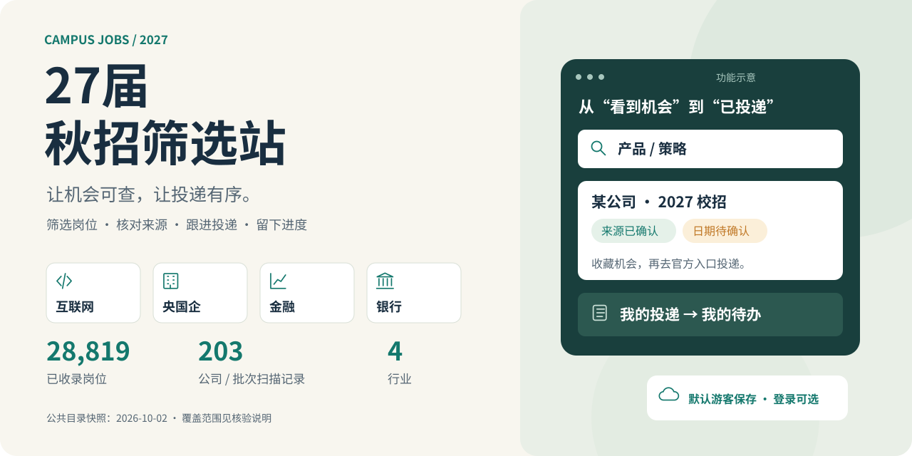
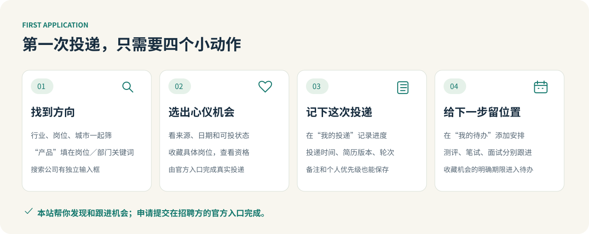
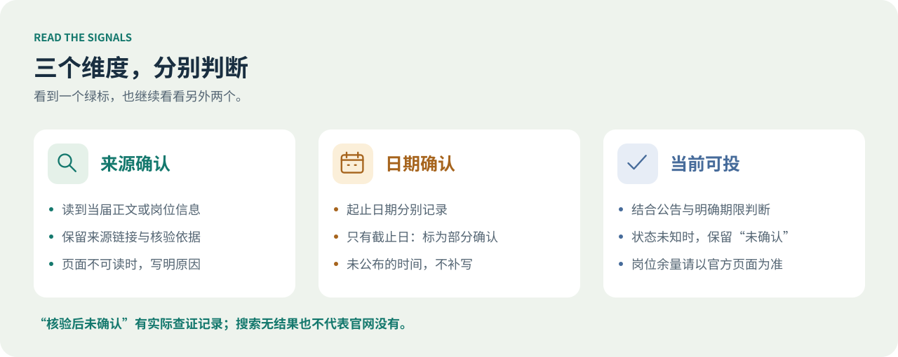
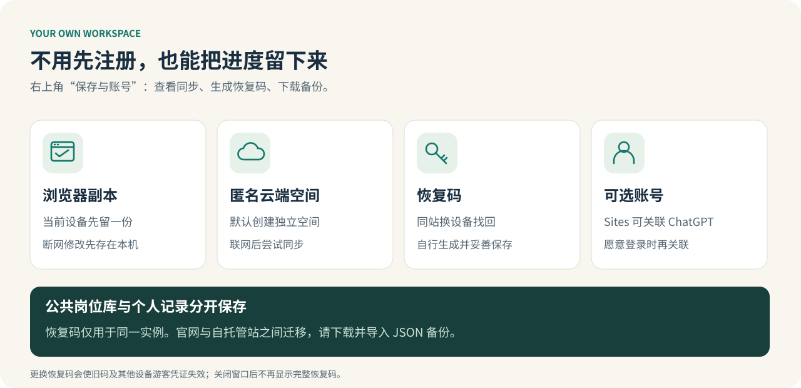

[](https://autumn27-screening.ottofeng00.chatgpt.site)

# 27届秋招筛选站

**让机会可查，让投递有序。** 互联网、央国企、金融、银行四类校招机会，放进同一个筛选与投递工作区。

<p align="center">
  <a href="https://autumn27-screening.ottofeng00.chatgpt.site"><strong>🚀 打开网站，直接使用</strong></a> ·
  <a href="docs/quick-start.md">一分钟上手</a> ·
  <a href="docs/self-hosting.md">自己部署</a> ·
  <a href="https://github.com/xcosmosbox/campus-jobs-2027/issues">反馈与纠错</a>
</p>

<p align="center">
  <a href="LICENSE"></a>
  <a href="docs/self-hosting.md"></a>
  <a href="docs/quick-start.md"></a>
</p>

> **只想用？[点击在线入口](https://autumn27-screening.ottofeng00.chatgpt.site)。** 网站已公开开放；无需安装，默认游客保存，账号关联可选。想自己管理实例，再看下方的自托管方式。

## 一个工作区，把秋招的几件事连起来

| 入口 | 用它做什么 |
| --- | --- |
| **机会筛选** | 按行业、公司、岗位、城市、应届资格、投递进度和截止日期组合筛选，优先查看临近截止的机会。 |
| **我的投递** | 记录投递时间、简历版本、测评／笔试／面试阶段、轮次和备注，给心仪岗位设个人优先级。 |
| **我的待办** | 整理收藏机会的明确投递期限，也能手动添加测评、笔试和面试安排。 |
| **核验与更新** | 查看来源、已读取范围与失败原因；个人复核可留下依据和修改历史。 |
| **保存与账号** | 查看云端同步与本机副本、生成恢复码、可选关联账号、导出／导入 JSON 备份。 |

## 3 分钟完成第一次投递



1. **先找方向。** 在“机会筛选”选择行业；想看产品岗，展开“岗位与应届资格”，在 **“岗位／部门关键词”填 `产品`**。公司名则填在单独的“搜索公司”框。
2. **再看时间。** 用“未来 7 天内”查看有明确期限的临近截止机会；也可以同时加城市、学历和毕业日期条件。
3. **打开一个机会。** 查看岗位资格、三个确认标签和核验依据，通过记录里的官方入口提交申请；本站记录你的进度。
4. **给自己留个回执。** 在详情中把进度改成“已投递”，记下投递时间和简历版本；到“我的待办”添加下一场测评或面试。
5. **最后把空间带走。** 打开右上角“保存与账号”，生成并保存恢复码，再下载一份备份。下次换设备，用恢复码找回。

小技巧：先用一个关键词试水，再逐项收紧条件。多个筛选条件需要同时满足；搜不到时，清除部分条件，并检查岗位库是否已加载完成。更多小窍门见 [一分钟上手](docs/quick-start.md)。

## 看懂三个标签，少一点猜测



**来源已确认、日期已确认、当前可投分别展示。** 当届公告已经读到，也可能没有公布截止时间；有公告和期限，也不保证每个岗位仍有名额。无法确认的信息明确保留原因与核验范围。

公共目录快照截至 **2026-10-02**：收录 **28,819 条岗位**，**203 家公司／批次均有扫描记录**。部分机构、子公司和批次只能读取部分列表或无法读取，不能理解为全部岗位均已获取。详情见 [核验口径](docs/catalog-verification.md)。

## 进度留下来，登录慢慢选



默认创建匿名云端空间，浏览器同时保留本机副本。断网修改先存本机，联网后尝试同步；两份内容有差异时，由你选择保留哪份。Sites 托管版提供可选 ChatGPT 账号关联；自托管默认使用游客与恢复码。

**公开岗位库与个人记录分开保存。** 恢复码只对应生成它的实例；官网与自托管站之间迁移，用“下载当前备份”和“选择 JSON 备份文件”。恢复码可用于访问你的空间，请妥善保存；完整内容仅在生成时显示。

*本 README 的四张图片均为原创功能示意图，便于快速理解；具体界面和数据以网站为准。*

## 想把它放到自己的电脑或服务器？

同一份页面和业务逻辑，Sites 托管版连接 D1，自托管版连接 SQLite。

```bash
git clone https://github.com/xcosmosbox/campus-jobs-2027.git
cd campus-jobs-2027
cp .env.example .env
docker compose up --build -d
```

打开 http://localhost:3000。首次启动自动建表，个人数据库保存在持久卷；更新公共岗位库不会覆盖个人进度。域名、Node 启动方式、备份和更新见 [自托管说明](docs/self-hosting.md)。

## 源码、公共数据与参与方式

JSON 是可核对的数据源；仓库 [datasets](datasets) 提供公共 SQLite／SQL 快照。生成自己的快照或公共源码包：

```bash
pnpm install --frozen-lockfile
pnpm run export:jobs    # exports/public-data：jobs.sqlite、jobs.sql 与哈希清单
pnpm run export:source  # exports/open-source：公共源码、配图与文件哈希清单
```

个人运行数据库、会话、恢复凭证和环境密钥不会进入源码导出包。数据结构见 [数据模型](docs/data-model.md)。

欢迎 [报告问题](https://github.com/xcosmosbox/campus-jobs-2027/issues) 或提交 PR。纠正岗位信息时，请附 **公司／岗位、官方来源链接、当届依据和核验日期**；未公布的时间继续保留“未确认”。请不要公开个人备份或恢复码。

<details>
<summary><strong>开发与验证命令</strong></summary>

Node.js 24、pnpm 11.25.0。已有检查与验证边界见 [验证记录](docs/selfhost-verification.md)。

```bash
pnpm run dev:selfhost    # 本地开发
pnpm run build:selfhost  # 自托管构建
pnpm run start:selfhost  # SQLite 生产服务
pnpm run check:selfhost  # 真实 HTTP 与持久化检查
pnpm run build           # Sites 构建
```

GitHub 推送与 Sites 部署分别执行；当前未配置推送后自动部署。

</details>

代码采用 [MIT 许可证](LICENSE)，第三方组件保留原许可。数据出处与使用说明见 [DATA_NOTICE.md](DATA_NOTICE.md)。
